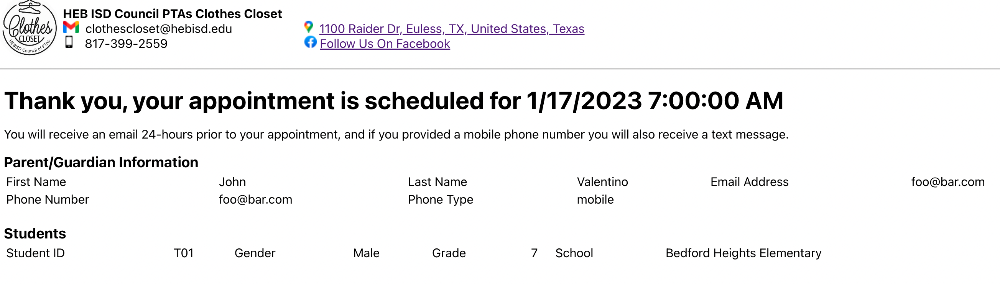
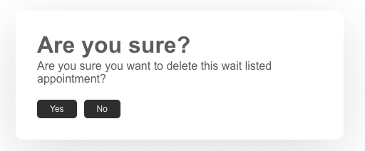
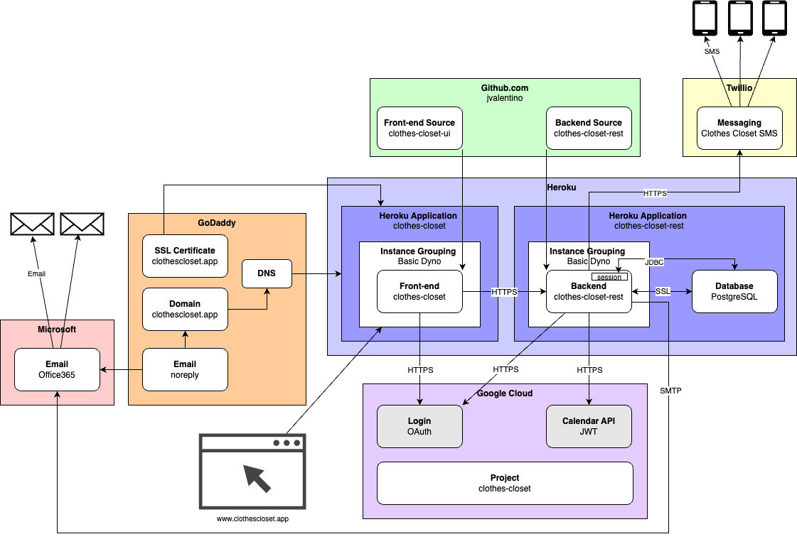

# Table of Contents

- [References](#references)
  * [User](#user)
  * [Developer](#developer)
- [User Experience](#user-experience)
  * [(1) Parent/Guardian Experience](#1-parentguardian-experience)
    + [Time Slot Available](#time-slot-available)
    + [Time Slot Not Available](#time-slot-not-available)
    + [Appointment Email Notification](#appointment-email-notification)
    + [Appointment SMS Notification](#appointment-sms-notification)
  * [(2) Administrator](#2-administrator)
    + [Calendar Management](#calendar-management)
    + [Login](#login)
    + [Dashboard](#dashboard)
    + [Appointment Search](#appointment-search)
      - [Appointment Selection](#appointment-selection)
        * [Appointment Printing](#appointment-printing)
        * [Add New Person](#add-new-person)
        * [Cancel Appointment](#cancel-appointment)
        * [Appointment No-Show](#appointment-no-show)
      - [Multi-Appointment Printing](#multi-appointment-printing)
    + [Settings Update](#settings-update)
    + [Student ID Upload](#student-id-upload)
    + [Reporting](#reporting)
    + [Locales](#locales)
    + [Email Notification](#email-notification)
    + [Wait List](#wait-list)
- [System Overview](#system-overview)
  * [(1) Github](#1-github)
  * [(2) Heroku](#2-heroku)
  * [(3) Google Cloud](#3-google-cloud)
  * [(4) GoDaddy](#4-godaddy)
    + [Domain/SSL](#domainssl)
    + [Email](#email)
- [System Cost](#system-cost)
- [Architectural Theory](#architectural-theory)
  * [2-Tier](#2-tier)
    + [Single Server (Rating: a dozen)](#single-server-rating-a-dozen)
    + [Dedicated Database Server (Rating: dozens)](#dedicated-database-server-rating-dozens)
    + [Multi-Backend (Rating: a hundred)](#multi-backend-rating-a-hundred)
    + [Database Cluster (Rating: hundreds)](#database-cluster-rating-hundreds)
  * [3-Tier](#3-tier)
    + [Database Cluster (Rating: a thousand)](#database-cluster-rating-a-thousand)
    + [Data warehousing (Rating: a thousand consistently)](#data-warehousing-rating-a-thousand-consistently)
  * [The Cloud](#the-cloud)
    + [Hybrid (Rating: thousands)](#hybrid-rating-thousands)
    + [SaaS (Rating: 10k)](#saas-rating-10k)
    + [Microservices and BFFs (Rating: 100k)](#microservices-and-bffs-rating-100k)
    + [CQRS and Domain Driven Design (Rating: 1m)](#cqrs-and-domain-driven-design-rating-1m)

# References

## User

- [Scheduling Page](https://www.clothescloset.app/) - The website used to schedule an appointment
- [Admin Login Page](https://www.clothescloset.app//login) - The page used for an admin to login to the management system

## Developer

- [Project Tracker](https://github.com/users/jvalentino/projects/2/views/1) - Used for keeping track of all the work that needs to be done on the system
- [Front-end Source Code](https://github.com/jvalentino/clothes-closet-ui) - The source code for the ReactJS based front-end, meaning the web-based graphical user interface
- [Backend Source Code](https://github.com/jvalentino/clothes-closet-rest) - The source code for the Java/Groovy Spring Boot based backend, meaning the backing services for the system including the Liquibase schema management for the datbaase.
- [Appointment Settings Service](https://clothes-closet-rest.herokuapp.com/appointment/settings) - An example of one of the many backing RESTful services, this one dedicated to returning appointment availability.
- [Google Cloud Application](https://console.cloud.google.com/welcome?project=clothes-closet-374119&pli=1) - The Google Cloud application used for managing the Oauth and calendar integrations.
- [Front-end Heroku Application](https://dashboard.heroku.com/apps/clothes-closet) - The application runtime environment for the front-end
- [Backend Heroku Application](https://dashboard.heroku.com/apps/clothes-closet-rest) - The applicaiton runtime environment for the back-end
- [Heroku Database](https://data.heroku.com/datastores/fdf20365-dadc-4804-8dd1-eb485d7f3aea) - The PostgreSQL database used for securely storing data.

# User Experience

The purpose of this system is to be able to schedule and manage family appointments at the Clothes Closet via an interactive website. Usage of this system depends on the type of user, for which there are two:

## (1) Parent/Guardian Experience

### Time Slot Available

It starts with the parent or guardian going to the website at https://clothes-closet.herokuapp.com/, entering in their contact information, entering in the students that are to come to the appointment (by Student ID), and then selecting an available appointment date and time. The available appointment times are determined by events on the Clothes Closet Google Calendar which are labeled as open, and are otherwise not during are already booked appointment.


When the "Schedule Appointment" button is pressed, the system checks against our own internal list of eligible students, which were given to us by the counselor. If a student is not on our list, they will receive an error stating so:


Otherwise, if everything is valid, the appointment will be scheduled:



### Time Slot Not Available

In the event no time slots are available, the end user will be given the option to be added to the wait lit:


### Appointment Email Notification


The intention is for the parent/guardian to be notified 24-hour prior via text message if they gave a mobile phone number, and then also by email.

### Appointment SMS Notification

Not done yet!

## (2) Administrator

### Calendar Management

It starts with the Clothes Closet Goolge calendar, which consits of times that it is avialable for appointment as designated by events labeled as "Open":


...and events that are the result of a family booking:


Note that none of the appointment details are available outside of the Clothes Closet Calendar, and the administrator protected portion of the online system.

### Login

Login is done via a Google Account at https://clothes-closet.herokuapp.com/login, meaning that we defer to Google's own authenitcation system, but then the user in question must be on our own explicit list of allowed admins.

### Dashboard

The purpose of this screen is to show summary stats for the current semester, highlight upcoming appointments, and notate appointments that have already passed and require attention.


### Appointment Search

Once logged in the admin has the ability to search through all appoinments by date and/or name:


#### Appointment Selection

Pressing the "View/Edit" button next to an appointment will bring up the data entry screen:


This is where additonal people can be added to the appointment, quantities can be entered or updated, the appointment can cancelled, or the apoointment can be marked as a no-show.

##### Appointment Printing

As during the appointment personal has to keep track of what each student took and adhere to certain limits, clicking on the "Print" button next to an apppointment brings up a version of the current form in use:


This is used for printing an individual appointment.

##### Add New Person

The purpose of doing this is for when someone else shows to the appointment, like brother, uncle, whatever, that was not on the original appoinment.


##### Cancel Appointment

Clicking this button on an appointment will prompt you to ask if you are sure, and if you select "Yes" it will delete this appointment from both the system and the Google calendar.


##### Appointment No-Show

Clicking this button will prompt you to mark this appointment as a no-show. Doing this will keep the appointment and related event on teh coogle calender for historical purposes. More important, this means that any student a part of this appointment will not be able to be a prt of another apoointment for the semester if the parent/guardian tries to sign up again.


#### Multi-Appointment Printing

There are checkboxes next to each appointment, and checking them is used to do a group selection for the purpose of printing out multiple appointments at a time. The "Select All" button will check all the boxes, while the "Unselect All" button will uncheck them all.


Clicking on the "Print Selected" button will have you download a PDF will all the appointments in it:


### Settings Update

This refers to the settings by gender that are used to designate the quantities that one can take.


### Student ID Upload

This refers to taking a spreadsheet as issued by the district and uploading it into our system.

The purpose of this page is to upload the list of eligible Students. This is done by taking the Excel spreadsheet that is given to us, saving it as a CSV file, and then pasting the content into the below text area. Note that doing this will erase all current eligible student information and replace it with what is given. The content will look like this:

```
Current Building Name,Student Id,Grade,Meal Status Name
Arbor Creek Elementary,T01 ,01,Eligible For Free Meals
Bedford Heights Elementary,T02 ,02,Eligible For Free Meals
Bedford Junior High,T03 ,03,Eligible For Free Meals
```

It must have the data in the order ot School Name, Student ID, Grade, and Meal status.


### Reporting

This refers to the ability to pull numbers form a given date range:


### Locales

This page is not actually protected, so anyone can get to it. Its purpose is to list all of the translation text used on the home page for appointment scheduling.


### Email Notification

Around 24-hour prior to the appointment, a reminder email will be sent to the guardian provided email, and also copy the clothes closet email address as well:


### Wait List

The purpose of this view is to be able to manage appointments that could not be scheduled because of a lack of time slots, and intead were put on the wait list. The options hwere are you:

1. Search By First or Last Name
2. View/Assign - This allows you to pick any time slot on the calender, whether available or not. By doing this the appointment is moved from the wait list, and also will have a Google Calendar event createf for it. 
3. Delete - This deletes the appointment from the wait list




# System Overview



The general architecture of the system is to make use of existing cloud-based services in order to provide a web-based user experience that is capable of persisting data, which specifically makes use of Google Cloud for both calendar integration and administrator authentication. This is because the core of the system is a Google Calendar that is used to mark both availability for appointments and then the appointments themselves. The system is otherwise comprised of the following layers:

## (1) Github

> GitHub, Inc. is an Internet hosting service for software development and version control using Git. It provides the distributed version control of Git plus access control, bug tracking, software feature requests, task management, continuous integration, and wikis for every project.

- https://en.wikipedia.org/wiki/GitHub

Since we are having to write custom software, we need a place for which to store and version the underlying code bases, specifically:

- https://github.com/jvalentino/clothes-closet-rest, which is the backend in combination with the database configuration
- https://github.com/jvalentino/clothes-closet-ui, which is the frontend and is what the end user direclty interacts with

Usage is completely free, and each repository is direclty tied to their respective Heroku application:

- https://github.com/jvalentino/clothes-closet-rest maps to https://dashboard.heroku.com/apps/clothes-closet-rest
- https://github.com/jvalentino/clothes-closet-ui maps to https://dashboard.heroku.com/apps/clothes-closet

On change to a given codebase, test automation is run, and if successful triggers the delivery of new versions of the repesctive appliction to Heroku.

## (2) Heroku

> Heroku is a cloud platform as a service supporting several programming languages. One of the first cloud platforms, Heroku has been in development since June 2007, when it supported only the Ruby programming language, but now supports Java, Node.js, Scala, Clojure, Python, PHP, and Go.

- https://en.wikipedia.org/wiki/Heroku

Heroku is used as the application runtime environment, where the frontend and backend applications each have their own independent runtimes operated on what is known as an Dyno:

> The [Heroku Platform](https://www.heroku.com/platform) uses the container model to run and scale all Heroku apps. The containers used at Heroku are called “dynos.” Dynos are isolated, virtualized Linux containers that are designed to execute code based on a user-specified command. Your app can scale to any specified number of dynos based on its resource demands. Heroku’s container management capabilities provide you with an easy way to scale and manage the number, size, and type of dynos your app may need at any given time.

- https://www.heroku.com/dynos

We were originally using the Eco Dynos, which are smallest available:

> The Eco dynos plan provides 1000 dyno hours for $5 per month. This dyno hours pool is shared by all Eco dynos in your account. The Eco dynos plan always renews on the first day of each month. If you subscribe to Eco after the first day, you are still charged the full $5 for that month.
>
> If an app has an Eco web dyno, and that dyno receives no web traffic in a 30-minute period, it **sleeps**. In addition to the web dyno sleeping, if you have a worker Eco dyno, it also sleeps.
>
> Eco web dynos do not consume Eco dyno hours while sleeping.
>
> If a sleeping web dyno receives web traffic, and your account has dyno hours available, the dyno becomes active again after a short delay.

- https://devcenter.heroku.com/articles/eco-dyno-hours

However, the Eco Dynos do not allow for custom SSL certificates, so I had to upgrade to Basic Dynes:


The Heroku environment consits of two applications, each of which maps to a web-based URL to make them accessible

- https://dashboard.heroku.com/apps/clothes-closet-rest maps to https://clothes-closet-rest.herokuapp.com, though you need to hit an accessible endpoint like https://clothes-closet-rest.herokuapp.com/appointment/settings to see it
- https://dashboard.heroku.com/apps/clothes-closet maps to https://clothes-closet.herokuapp.com/

The backend is otherwise directly mapped to a Heroku managed PostgreSQL instance for storing data:


However, the basic database plan (https://data.heroku.com/datastores/fdf20365-dadc-4804-8dd1-eb485d7f3aea) costs $9 a month. We can't use the mini plan because it is limited to 10,000 rows of data.

## (3) Google Cloud

> Google Cloud Platform, offered by Google, is a suite of cloud computing services that runs on the same infrastructure that Google uses internally for its end-user products, such as Google Search, Gmail, Google Drive, and YouTube.

- https://en.wikipedia.org/wiki/Google_Cloud_Platform

This system specifically uses two different integrations, as designated by the different credentials:


- clothes-closet-web is the OAuth credentials, used for allowing signing in via google
- the service account is what is used to do the calender interaction

There is no charge for the level of usage currently in place, which is less than 10,000 requests per day.

## (4) GoDaddy

### Domain/SSL

https://www.godaddy.com/ just happens to be the means by which the custom domain of https://clothescloset.app was purchased, including it SSL certificate that is needed for that https part of the URL. This has become required as most browsers won't even allow you to go to an http site by default anymore. Using this with Heroku though required some special DNS-level configuraiton.


### Email

You would think that I could just use Google Cloud, but service accounts aren't allowed to send email according to the internet.

I then had to add basic email support to the domain, and then setup the mailbox:


After creating a new email account, you have to manually enable SMTP:


Since this can't be just this easy, consider the GoDaddy SMTP limits the number of emails to 25 per day, which is useless. Thankfully GoDaddy sets up Office3655, so you can just use their SMTP with the following limits:

> Office 365 users are limited by the following: 
>
> - 10,000 sent email messages per day
> - 500 recipients total for a single email
> - 30 emails sent per minute

https://support.nutshell.com/hc/en-us/articles/360013686553-Email-sending-limitations

The SMTP settings where then a matter of trial and error:

```properties
spring.mail.host=smtp.office365.com
spring.mail.port=587
spring.mail.username=noreply@clothescloset.app
spring.mail.properties.mail.smtp.auth=true
spring.mail.properties.mail.smtp.starttls.enable=true
```

https://www.godaddy.com/help/server-and-port-settings-for-workspace-email-6949 was the only place to get it correct.


# System Cost

| Platform | URL                                                          | Cost                  | Description                                        |
| -------- | ------------------------------------------------------------ | --------------------- | -------------------------------------------------- |
| Heroku   | https://dashboard.heroku.com/apps/clothes-closet/resources   | $7/month or $84/year  | Front-end application runtime using the Basic Dyno |
| Heroku   | https://dashboard.heroku.com/apps/clothes-closet-rest/resources | $7/month or $84/year  | Backend application runtime using the Basic Dyno   |
| Heroku   | https://dashboard.heroku.com/apps/clothes-closet-rest/resources | $9/month or $108/year | Postges database usingthe Basic Plan               |
| GoDaddy  | https://account.godaddy.com/receipts                         | $17.99/year           | Domain name with SSL certificate                   |
| GoDaddy  | https://account.godaddy.com/receipts                         | $23.88/year           | Email Address for SMTP                             |

Total Cost: $317.87/year

# Architectural Theory

As I am using this system as a teaching tool, there have been lots of questions around scalability. In order to address those questions lets confine scalability as "a means of supporting variable and growing numbers of concurrent users." There are also two types of scalabilty:

- **Vertical** - Add more power to make it do better. For example, you could add more and/or faster CPUs to a server in order to get better performance. This type of scaling is both limited, and not preferable. While you can boost your EC2 instance for example to the max memory and CPU possible, that limit is as far as you go go.
- **Horizontal** - Add more instances to make it do better. While this can go a long way, and theoretically near infinite depending on the use case, this is more complicated that just improving hardware specifications, because it is entirely dependent on the architectrual context.

## 2-Tier

### Single Server (Rating: a dozen)

There was no concept of separation of front-end and backend, and server-side scripting technologies would handle both aspects. Specificaly when a browser would make a request for a page, the backend would handle dynamically generating the HTML content  for the browser as a part of that one request. Generally, we would do this all on a single server:


Pros

- None

Cons

- No separation between front-end and backend.
- Resource contention between backend and database.
- Session is maintained in server-memory, thus limiting the number of concurrent users.
- A single user facing server, thus concurrent load is highly limited.
- The more data that goes into the database, the slower it performs.
- Core reliance on RDMS limits upper scalability.

### Dedicated Database Server (Rating: dozens)

Obviously with both the backend and the database on the same server, resource contention was high. This made the first obvious step to move the data persitence onto its own server:


Pros

- Backend and Database independent, allowing us have different optimized servers.

Cons

- No separation between front-end and backend.
- Incentivizes a snowflake architecture by having to fine tune the server hardware differently.
- Session is maintained in server-memory, thus limiting the number of concurrent users.
- A single user facing server, thus concurrent load is highly limited.
- The more data that goes into the database, the slower it performs.
- Core reliance on RDMS limits upper scalability.

### Multi-Backend (Rating: a hundred)

Now to tackle the fact that we need more servers (and instances) to handle user load, we start adding more servers to run more backend instances. The result though is that we need a way to direct traffier to the appropriate instance based on load, which is where we get Load Balancers. A consequence though of using a load balancer with in-memory sessions though, is that only the instance which handles the initial user authentication has knowledge of that session, so that user is tied to that instance.


Pros

- Backend and Database independent, allowing us have different optimized servers.
- Multple backends allows us to handle more load from users.

Cons

- No separation between front-end and backend.
- Incentivizes a snowflake architecture by having to fine tune the server hardware differently.
- Session is maintained in server-memory, thus limiting the number of concurrent users.
- You are paying for that second instance even when you don't need it.
- The more data that goes into the database, the slower it performs.
- The database is now a prime bottlekneck.
- Core reliance on RDMS limits upper scalability.

### Database Cluster (Rating: hundreds)

Now it is time to handle the database being a bottlekneck. We handle it the same way we always do, by adding more instances. At the same time though to really see support higher load, we can't have user session information in memory so we move it into the database instead, removing the need for sticky sessions.


Pros

- Backend and Database independent, allowing us have different optimized servers.
- Multple backends allows us to handle more load from users.
- A database cluster removes the database from being the solo bottlekneck.
- Session is maintained in the database, taking it out of memory.

Cons

- No separation between front-end and backend.
- Incentivizes a snowflake architecture by having to fine tune the server hardware differently.
- You are paying for that second instance even when you don't need it.
- The more data that goes into the database, the slower it performs.
- The addition of database land tripled the budget in hardware costs. 
- Core reliance on RDMS limits upper scalability.

## 3-Tier

### Database Cluster (Rating: a thousand)

Before jumping off into higher load ratings, it is important to understand the realization that front-end was best to be separated from backend, giving us what we commonly call 3-tier. Instead of relying on the single backend to do everything, we started buidling standalone Javascript based front-end to dynamically render content asynchronously, and only calling the backend when needed. Contunuing on the current path, that makes our last example now look like this:


Pros

- Backend and Database independent, allowing us have different optimized servers.
- Multple backends allows us to handle more load from users.
- A database cluster removes the database from being the solo bottlekneck.
- Session is maintained in the database, taking it out of memory.
- Separation between backend and frontend allows for slightly more load.

Cons

- Incentivizes a snowflake architecture by having to fine tune the server hardware differently.
- You are paying for that second instance even when you don't need it.
- The more data that goes into the database, the slower it performs.
- The addition of database land tripled the budget in hardware costs. 
- Core reliance on RDMS limits upper scalability.

### Data warehousing (Rating: a thousand consistently)

A common problem that systems eventually run into given enough time, is that the more data stored in their system, the slower the systems perform. This is basically Relational Databases are not infinately horizontally scalalable. This had lead to what we call data warehousing. This is where the core system generally only contains data relevant to some time window (in years) relative to current, and a specialized database cluster is created for the purpose of historial inquiry. This is also the "big data" problem, which has its own solutions, but it is important to understand where it started.


Pros

- Backend and Database independent, allowing us have different optimized servers.
- Multple backends allows us to handle more load from users.
- A database cluster removes the database from being the solo bottlekneck.
- Session is maintained in the database, taking it out of memory.
- Separation between backend and frontend allows for slightly more load.
- Data is continually and selectively pruned from the system to mitigate sizing issues.

Cons

- Incentivizes a snowflake architecture by having to fine tune the server hardware differently.
- You are paying for that second instance even when you don't need it.
- The addition of database land tripled the budget in hardware costs. 
- You had to double your budget again by adding a data warehouse.
- Usage of the data warehouse required specialized tools and knowledge.
- Core reliance on RDMS limits upper scalability.

## The Cloud

The cloud is simple. it is just a means of having someone else host and maintain your hardware. The biggest mistake companies make when "moving to the cloud" is not considerig that just a "lift and shift" can see a 5-10x cost in hosting. This is because the true savings in the cloud is only paying for what you need, and when you need it.  There is where you want to rely on both Platforms and Software as a Service, but we will start with PaaS.

### Hybrid (Rating: thousands)

The first barrier to cloud entry is that you likely have a ton of snowfakes, meaning unqiuely configured server for which there is no knowledge of how it was actually done. The practice you should have been following is Configuration as Code, and because you likely didn't do that one of the first steps will be figuring out how to reproduce all of that infrastructure. It is best to start with easier, which are always the application servers. How to run an application server in a container is one Google seach away, so start there. Additionaly it is important to reply on the Cloud Provider's continer managemetn solution, so that it can spin up and down containers as needed, instead of having to rely on static hardware, fixed instances, and your own load balancer.


Pros

- Backend and Database independent, allowing us have different optimized servers.
- Multple backends allows us to handle more load from users.
- A database cluster removes the database from being the solo bottlekneck.
- Session is maintained in the database, taking it out of memory.
- Separation between backend and frontend allows for slightly more load.
- Data is continually and selectively pruned from the system to mitigate sizing issues.
- Running the applications architecures on an elastic container platform allows them to scale up and down as needed.

Cons

- Incentivizes a snowflake architecture by having to fine tune the server hardware differently.
- You are paying for that second instance even when you don't need it.
- The addition of database land tripled the budget in hardware costs. 
- You had to double your budget again by adding a data warehouse.
- Usage of the data warehouse required specialized tools and knowledge.
- Core reliance on RDMS limits upper scalability.

### SaaS (Rating: 10k)

*FYI: this is where the Clothes Closet System is, without the data warehousing, thougn only running a single application instance.*

Use software as a service (SaaS) nearly all the time when available. This is because it significantly reduces your complexity and overhead. For example, you no longer need to be a X-Whatever-Database Clustering Expert, you just use it as a service from your cloud platform. However, where you might have been able to get away having devs logging into 20 or so servers to pull logs and gather metrics, that is no longer an option in this environment. That is because everything is dynamic, meaning it can go away if not in use. This forces you to have to being in:

- Monitoring - To know the health of everything
- Alerting - To know when human intervention is required
- Centralized Logging - To get to the logs in once place


Pros

- Backend and Database independent, allowing us have different optimized servers.
- Multple backends allows us to handle more load from users.
- A database cluster removes the database from being the solo bottlekneck.
- Session is maintained in the database, taking it out of memory.
- Separation between backend and frontend allows for slightly more load.
- Data is continually and selectively pruned from the system to mitigate sizing issues.
- Running the applications architecures on an elastic container platform allows them to scale up and down as needed.
- Using database as a service removed the need to deal with the details yourself.

Cons

- Core reliance on RDMS limits upper scalability.

### Microservices and BFFs (Rating: 100k)

Want to do more? Run more stuff in parallel. Considering that most systems have more than one point of graphical interaction, it is helpful to use the BFF pattern, which has a dedicated backend for each front-end. This both alleviates the load on the solo backend application group, but also allows for specific services for specific clients, as it is highly unlikely that the mobile app receives and sends the same data as the web portal, for example. This also allows each BFF to manage its own session independently, and via a distributed cache insteaf of a database because it is significantly faster. Each of these BFFs is also storing its own data in a NoSQL database, which is faster than RBDMS, with the tradeoff being that you have duplicate data (which isn't really a problem).

The other big change is that the single backend application was broken into multiple applications based on service area. This is highly dependent on what the system does, but allows you to scale at a level of granuliaty that was not possible prior.


Pros

- Backend and Database independent, allowing us have different optimized servers.
- Multple backends allows us to handle more load from users.
- A database cluster removes the database from being the solo bottlekneck.
- Session is maintained in the database, taking it out of memory.
- Separation between backend and frontend allows for slightly more load.
- Data is continually and selectively pruned from the system to mitigate sizing issues.
- Running the applications architecures on an elastic container platform allows them to scale up and down as needed.
- Using database as a service removed the need to deal with the details yourself.
- Highly granular scaling possible.
- Usage of BFF caching and NoSQL greatly increases scalability.

Cons

- Reliance on RDMS limits upper scalability.

### CQRS and Domain Driven Design (Rating: 1m)

To understand what this means you first need to be familiar with:

1. CAP Theorem
2. Eventual Consitentancy
3. CQRS
4. Domain Driven Design

What the following system does is eliminate the RDBMS as the source of truth, and instead relies on a stream of events by which each domain builds their own representation of that truth based on the individual needs. This critical impact here is that technologies like Kafka are able to handle billions of events per seconds (see LinkedIn) as opposed to traditional messages buses, and well beyond the rate of any NoSQL or RDBMS. The end-result of this though is that the system is eventually consistent, requiring a different approach to reading and writing data, which is where CQRS comes in to play.

- RESTful services get data by directly pulling it using a query out of a NoSQL database.
- If a RESTful services needs to create, update, or delete data it has two options: 1) Call another RESTful service, 2) dispatch the appropriate event to the Event Bus.
- Aggregators are responsible for streaming events from the Event Bus, and using the relevant events to construct the data in their domain specific materlialized views.

The domain driven design aspect can be seen in the organization of the system into domains. Each domain functions like its own system, with its only connection outside of the domain being the Event Bus, and knowledge of other RESTful services.


Pros

- Backend and Database independent, allowing us have different optimized servers.
- Multple backends allows us to handle more load from users.
- A database cluster removes the database from being the solo bottlekneck.
- Session is maintained in the database, taking it out of memory.
- Separation between backend and frontend allows for slightly more load.
- Data is continually and selectively pruned from the system to mitigate sizing issues.
- Running the applications architecures on an elastic container platform allows them to scale up and down as needed.
- Using database as a service removed the need to deal with the details yourself.
- Highly granular scaling possible.
- Usage of BFF caching and NoSQL greatly increases scalability.
- Capable of billions of events per second with the right approach.

Cons

- Complexity.
