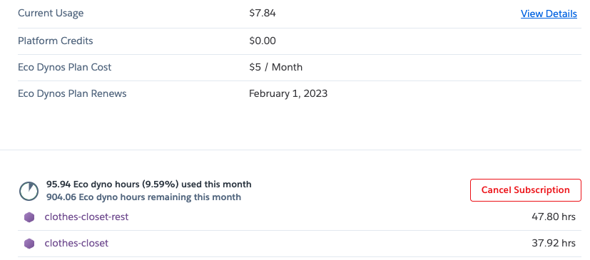

# References

## User

- [Scheduling Page](https://clothes-closet.herokuapp.com/) - The website used to schedule an appointment
- [Admin Login Page](https://clothes-closet.herokuapp.com/login) - The page used for an admin to login to the management system

## Developer

- [Project Tracker](https://github.com/users/jvalentino/projects/2/views/1) - Used for keeping track of all the work that needs to be done on the system
- [Front-end Source Code](https://github.com/jvalentino/clothes-closet-ui) - The source code for the ReactJS based front-end, meaning the web-based graphical user interface
- [Backend Source Code](https://github.com/jvalentino/clothes-closet-rest) - The source code for the Java/Groovy Spring Boot based backend, meaning the backing services for the system including the Liquibase schema management for the datbaase.
- [Appointment Settings Service](https://clothes-closet-rest.herokuapp.com/appointment/settings) - An example of one of the many backing RESTful services, this one dedicated to returning appointment availability.
- [Google Cloud Application](https://console.cloud.google.com/welcome?project=clothes-closet-374119&pli=1) - The Google Cloud application used for managing the Oauth and calendar integrations.
- [Front-end Heroku Application](https://dashboard.heroku.com/apps/clothes-closet) - The application runtime environment for the front-end
- [Backend Heroku Application](https://dashboard.heroku.com/apps/clothes-closet-rest) - The applicaiton runtime environment for the back-end
- [Heroku Database](https://data.heroku.com/datastores/fdf20365-dadc-4804-8dd1-eb485d7f3aea) - The PostgreSQL database used for securely storing data.

# User Experience

The purpose of this system is to be able to schedule and manage family appointments at the Clothes Closet via an interactive website. Usage of this system depends on the type of user, for which there are two:

## (1) Parent/Guardian Experience

It starts with the parent or guardian going to the website at https://clothes-closet.herokuapp.com/, entering in their contact information, entering in the students that are to come to the appointment (by Student ID), and then selecting an available appointment date and time. The available appointment times are determined by events on the Clothes Closet Google Calendar which are labeled as open, and are otherwise not during are already booked appointment.

When the "Schedule Appointment" button is pressed, the system checks against our own internal list of eligible students, which were given to us by the counselor. If a student is not on our list, they will receive an error stating so:

Otherwise, if everything is valid, the appointment will be scheduled:

### Appointment Notification

Not done yet!

The intention is for the parent/guardian to be notified 24-hour prior via text message if they gave a mobile phone number, and then also by email.

## (2) Administrator

### Calendar Management

It starts with the Clothes Closet Goolge calendar, which consits of times that it is avialable for appointment as designated by events labeled as "Open":

...and events that are the result of a family booking:

Note that none of the appointment details are available outside of the Clothes Closet Calendar, and the administrator protected portion of the online system.

### Login

Login is done via a Google Account at https://clothes-closet.herokuapp.com/login, meaning that we defer to Google's own authenitcation system, but then the user in question must be on our own explicit list of allowed admins.

### Appointment Search

Once logged in the admin has the ability to search through all appoinments by date and/or name:

### Appointment Printing

As during the appointment personal has to keep track of what each student took and adhere to certain limits, clicking on the "Print" button next to an apppointment brings up a version of the current form in use:

### Appointment Selection

Pressing the "Select" button next to an appointment will bring up the data entry screen:

This is where additonal people can be added to the appointment, quantities can be entered or updated, and the appointment can also be cancelled.

### Settings Update

This refers to the settings by gender that are used to designate the quantities that one can take.

TBD: A user experience does not currently exist for this so its data must be entered manually by John Valentino directly into its database.

### Student ID Upload

This refers to taking a spreadsheet as issued by the district and uploading it into our system.

TBD: A user experience does not currently exist for this so its data must be entered manually by John Valentino directly into its database.

# System Overview

The general architecture of the system is to make use of existing cloud-based services in order to provide a web-based user experience that is capable of persisting data, which specifically makes use of Google Cloud for both calendar integration and administrator authentication. This is because the core of the system is a Google Calendar that is used to mark both availability for appointments and then the appointments themselves. The system is otherwise comprised of the following layers:

## (1) Github

> GitHub, Inc. is an Internet hosting service for software development and version control using Git. It provides the distributed version control of Git plus access control, bug tracking, software feature requests, task management, continuous integration, and wikis for every project.

- https://en.wikipedia.org/wiki/GitHub

Since we are having to write custom software, we need a place for which to store and version the underlying code bases, specifically:

- https://github.com/jvalentino/clothes-closet-rest, which is the backend in combination with the database configuration
- https://github.com/jvalentino/clothes-closet-ui, which is the frontend and is what the end user direclty interacts with

Usage is completely free, and each repository is direclty tied to their respective Heroku application:

- https://github.com/jvalentino/clothes-closet-rest maps to https://dashboard.heroku.com/apps/clothes-closet-rest
- https://github.com/jvalentino/clothes-closet-ui maps to https://dashboard.heroku.com/apps/clothes-closet

On change to a given codebase, test automation is run, and if successful triggers the delivery of new versions of the repesctive appliction to Heroku.

## (2) Heroku

> Heroku is a cloud platform as a service supporting several programming languages. One of the first cloud platforms, Heroku has been in development since June 2007, when it supported only the Ruby programming language, but now supports Java, Node.js, Scala, Clojure, Python, PHP, and Go.

- https://en.wikipedia.org/wiki/Heroku

Heroku is used as the application runtime environment, where the frontend and backend applications each have their own independent runtimes operated on what is known as an Dyno:

> The [Heroku Platform](https://www.heroku.com/platform) uses the container model to run and scale all Heroku apps. The containers used at Heroku are called “dynos.” Dynos are isolated, virtualized Linux containers that are designed to execute code based on a user-specified command. Your app can scale to any specified number of dynos based on its resource demands. Heroku’s container management capabilities provide you with an easy way to scale and manage the number, size, and type of dynos your app may need at any given time.

- https://www.heroku.com/dynos

We are specifically using the Eco Dynos, which are smallest available:

> The Eco dynos plan provides 1000 dyno hours for $5 per month. This dyno hours pool is shared by all Eco dynos in your account. The Eco dynos plan always renews on the first day of each month. If you subscribe to Eco after the first day, you are still charged the full $5 for that month.
>
> If an app has an Eco web dyno, and that dyno receives no web traffic in a 30-minute period, it **sleeps**. In addition to the web dyno sleeping, if you have a worker Eco dyno, it also sleeps.
>
> Eco web dynos do not consume Eco dyno hours while sleeping.
>
> If a sleeping web dyno receives web traffic, and your account has dyno hours available, the dyno becomes active again after a short delay.

- https://devcenter.heroku.com/articles/eco-dyno-hours

The Heroku environment consits of two applications, each of which maps to a web-based URL to make them accessible

- https://dashboard.heroku.com/apps/clothes-closet-rest maps to https://clothes-closet-rest.herokuapp.com, though you need to hit an accessible endpoint like https://clothes-closet-rest.herokuapp.com/appointment/settings to see it
- https://dashboard.heroku.com/apps/clothes-closet maps to https://clothes-closet.herokuapp.com/

The backend is otherwise directly mapped to a Heroku managed PostgreSQL instance for storing data:

However, the basic database plan (https://data.heroku.com/datastores/fdf20365-dadc-4804-8dd1-eb485d7f3aea) costs $9 a month. We can't use the mini plan because it is limited to 10,000 rows of data.

## (3) Google Cloud

> Google Cloud Platform, offered by Google, is a suite of cloud computing services that runs on the same infrastructure that Google uses internally for its end-user products, such as Google Search, Gmail, Google Drive, and YouTube.

- https://en.wikipedia.org/wiki/Google_Cloud_Platform

This system specifically uses two different integrations, as designated by the different credentials:

- clothes-closet-web is the OAuth credentials, used for allowing signing in via google
- the service account is what is used to do the calender interaction

There is no charge for the level of usage currently in place, which is less than 10,000 requests per day.

